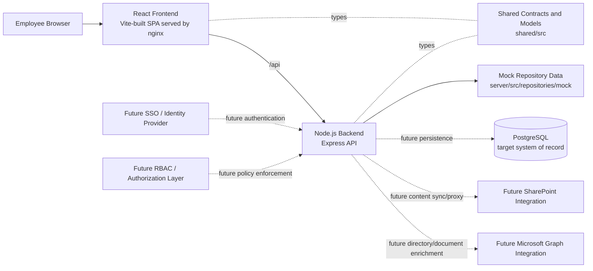

# High-Level Solution Architecture

This solution is structured as a browser-based React application consuming a Node.js API, with shared TypeScript contracts coordinating data shapes across the stack. The backend currently reads from mock repository data, but its service and repository boundaries are already positioned to move to PostgreSQL and future SharePoint, Graph, SSO, and RBAC integrations without changing the frontend contract.
