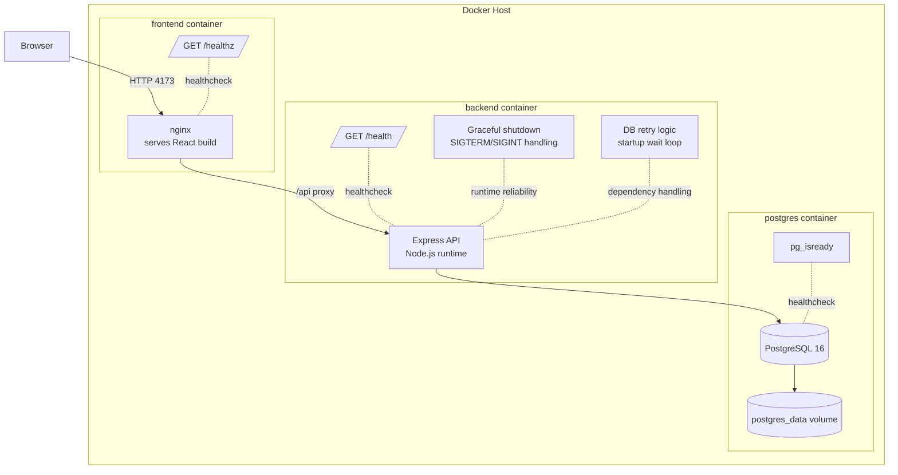

# Deployment And Container Architecture

The deployed stack uses three containers defined in `docker-compose.yml`: frontend, backend, and postgres. Each service has `restart: always`, health checks, and clear separation of responsibilities, while PostgreSQL state is persisted via the `postgres_data` named volume.
