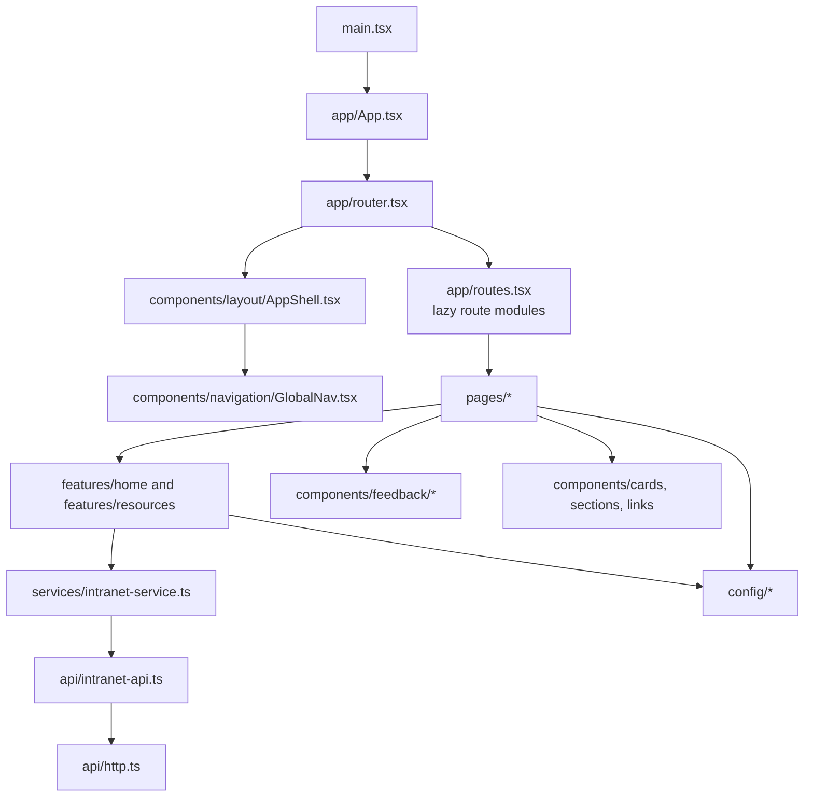

# Frontend Architecture

The frontend is organized around route entry pages, feature-level composition, and shared presentation components. Data access is centralized through the API and service layer, keeping presentational components focused on rendering and preserving a clean separation between UI, configuration, and remote data loading.
