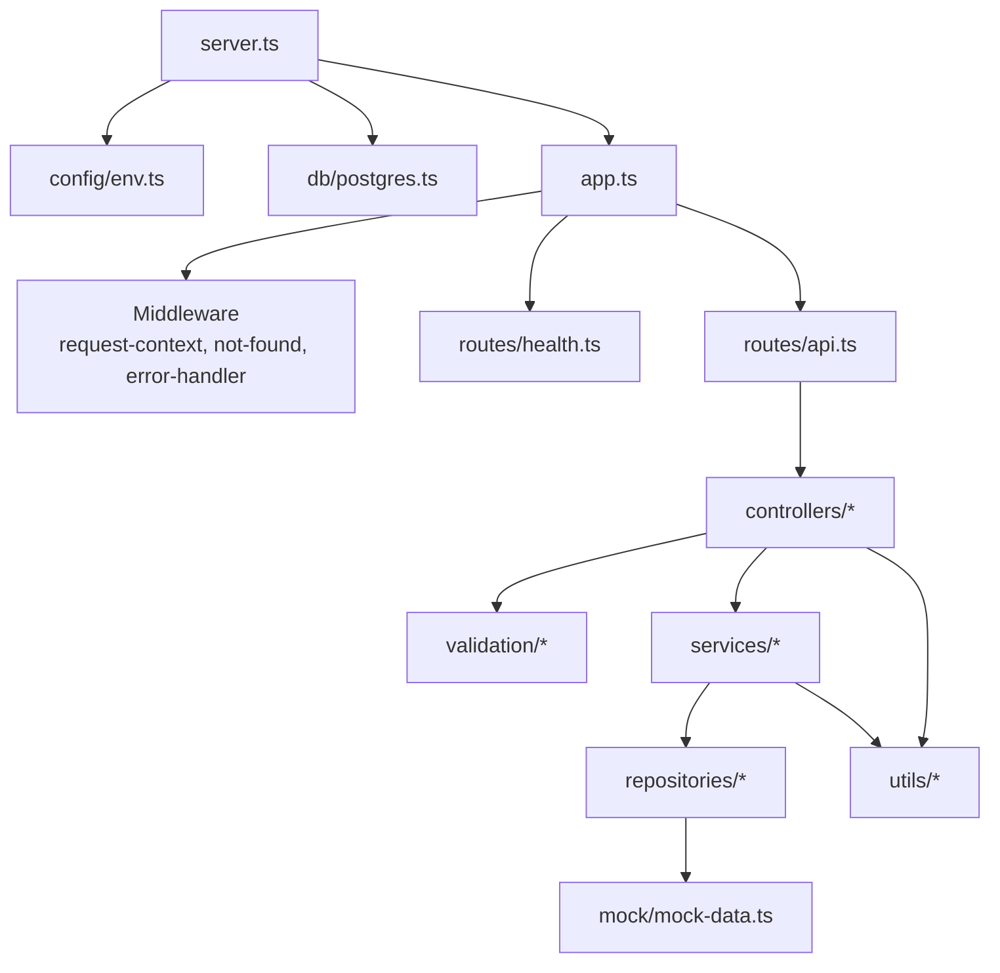

# Backend Architecture

The backend follows a thin-route, layered service architecture. Express routes delegate to controllers, controllers validate and shape requests, services orchestrate domain logic, and repositories own data access so mock data can later be replaced by PostgreSQL queries or external integration adapters.
