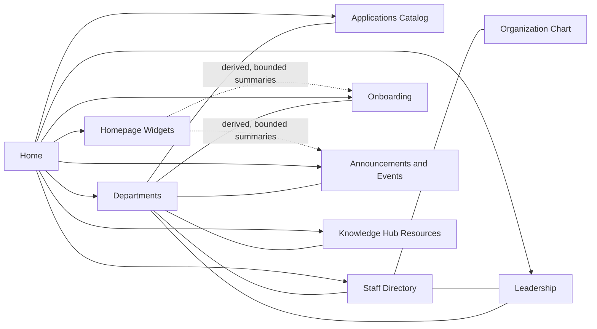

# Domain And Module Architecture

The platform is organized around business domains rather than page-only concerns. The homepage aggregates selected slices from the applications, resources, directory, departments, onboarding, leadership, and news domains, while widgets remain a separate lightweight aggregation path to avoid coupling non-critical content to the main homepage payload.
