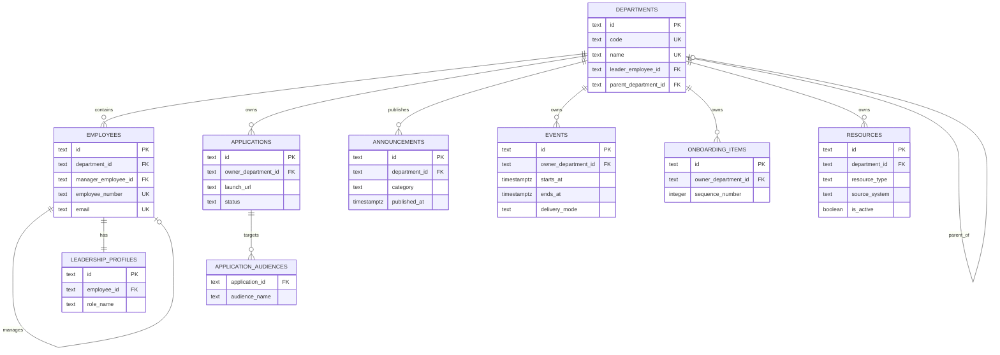

# Database ER Diagram

The current schema direction is relational and normalized around departments, employees, and domain-specific content tables. It supports referential integrity for ownership, department alignment, and staff relationships while leaving room for future RBAC, audit, and caching structures.
