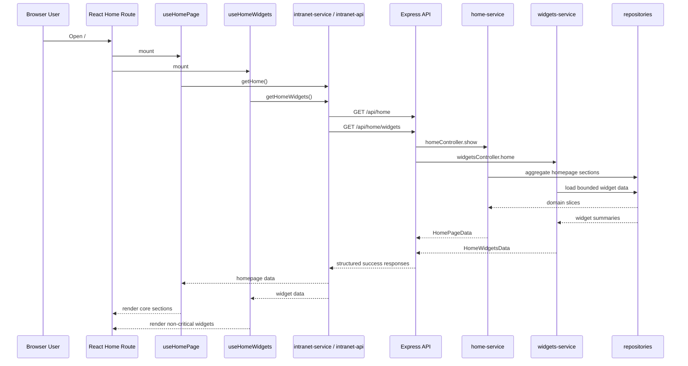

# Homepage Request Flow

The homepage uses two independent API calls: one for the main page content and one for lightweight widgets. This keeps the critical path smaller, preserves fallback behavior for non-critical sections, and aligns with the existing `HomePageView` and `HomeWidgetsPanel` implementation.
