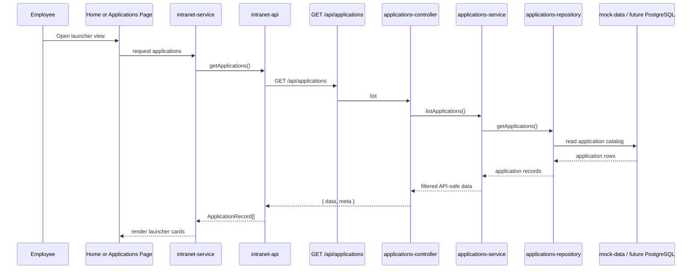

# Application Launcher Flow

The application launcher is a direct catalog flow with thin HTTP handling and repository-backed data retrieval. This keeps card rendering separate from catalog ownership, while allowing later RBAC filtering and PostgreSQL-backed queries inside the service or repository layer.
