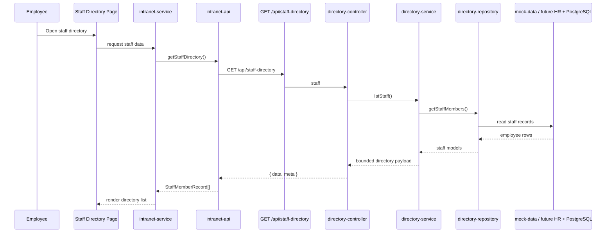

# Staff Directory Flow

The staff directory flow is already isolated behind the directory domain, which makes future HR system enrichment straightforward. The backend is the place to add employee filtering, RBAC-based visibility, and Graph-backed directory augmentation without exposing raw source-system details to the frontend.
