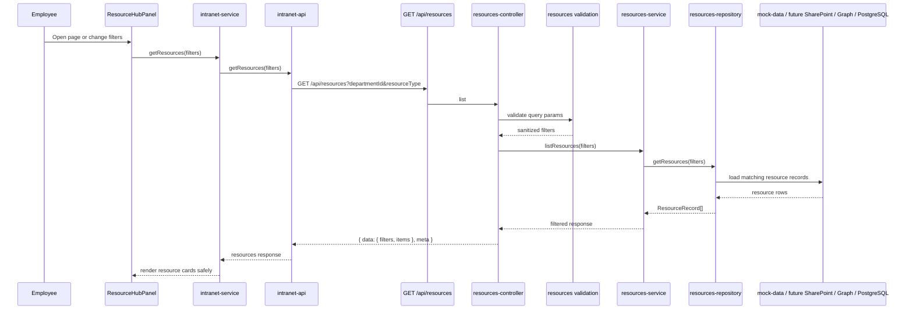

# Resource Hub Flow

The resource hub is implemented as a dedicated domain with explicit filtering by department and resource type. That matches the current API contract and gives the backend a clean place to add SharePoint synchronization, Graph metadata enrichment, permission checks, and caching later.
