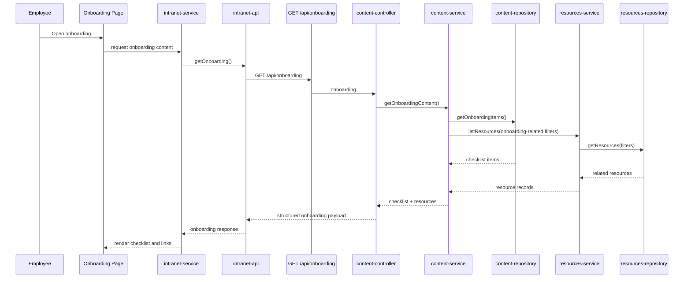

# Employee Onboarding Flow

The onboarding page combines ordered onboarding items with reusable knowledge-hub resources through backend composition. This keeps onboarding-specific orchestration in the service layer and allows future personalization, department-specific onboarding, or role-based filtering without moving logic into React components.
