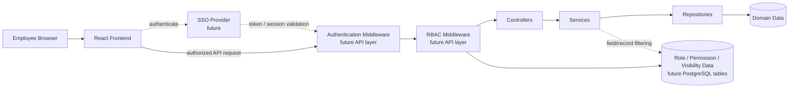

# Authentication And RBAC Future-State Flow

The current codebase already marks middleware hooks in `server/src/routes/api.ts` for future authentication and route-level RBAC. The intended model is to validate identity at the API boundary, then apply role- and department-aware filtering in middleware and service layers so unauthorized records are never sent to the frontend.
